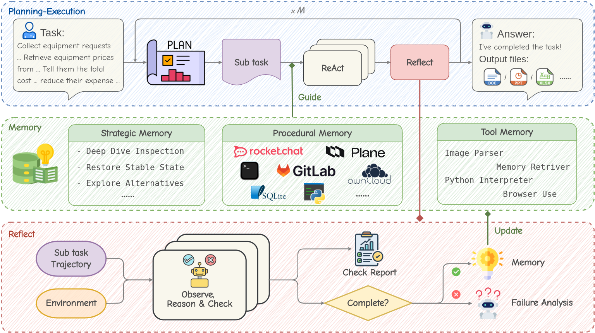

# Learning on the Job: An Experience-Driven Self-Evolving Agent for Long-Horizon Tasks
---

Large Language Models have demonstrated remarkable capabilities across diverse domains, yet significant challenges persist when deploying them as AI agents for real-world long-horizon tasks. Existing LLM agents suffer from a critical limitation: they are test-time static and cannot learn from experience, lacking the ability to accumulate knowledge and continuously improve on the job. To address this challenge, we propose MUSE, a novel agent framework that introduces an experience-driven, self-evolving system centered around a hierarchical Memory Module. MUSE organizes diverse levels of experience and leverages them to plan and execute long-horizon tasks across multiple applications. After each sub-task execution, the agent autonomously reflects on its trajectory, converting the raw trajectory into structured experience and integrating it back into the Memory Module. This mechanism enables the agent to evolve beyond its static pretrained parameters, fostering continuous learning and self-evolution. We evaluate MUSE on the long-horizon productivity benchmark TAC. It achieves new SOTA performance by a significant margin using only a lightweight Gemini-2.5 Flash model. Sufficient Experiments demonstrate that as the agent autonomously accumulates experience, it exhibits increasingly superior task completion capabilities, as well as robust continuous learning and self-evolution capabilities. Moreover, the accumulated experience from MUSE exhibits strong generalization properties, enabling zero-shot improvement on new tasks. MUSE establishes a new paradigm for AI agents capable of real-world productivity task automation.

## About Agent Final State
The trajectories we submitted in the `trajectories/` folder are simplified versions, showing only the trajectories of the PE Agent in our architecture.
They have been reformatted into human-readable text for easier interpretation.

The complete system state after each single-task execution can be found in the `states/` folder.
Each JSON file in this folder follows the structure below:
```json  
{
    "monitor_state": {
        "num_actions": ...,             // Number of tool calls made by the PE Agent
        "time_used": ...,               // Total runtime of the task
        "tool_call": ...,               // Detailed tool usage information
        "done_subtasks": {              // Subtask-level detailed records
            "name": ...,                // Subtask name
            "goal": ...,                // Subtask goal
            "index": ...,               // Subtask index
            "finish": ...,              // Whether the subtask is judged as completed
            "trajectory": ...,          // Execution trajectory of the PE Agent for this subtask
            "reflect_trajectory": ...,  // Execution trajectory of the Reflect Agent for this subtask
            "reflection": ...,          // Reflection results of the subtask
            "try_times": ...            // Number of attempts made for this subtask
        },
        "exception": ...                // System exception or error information during execution
    },
    "enhance_dicts": ...                // Memory after running this task
}
```  

## Evaluation Results Report (Gemini-2.5-flash, with 3 round memory)
### Results per File
| Filename                                                   | Total | Result | Score |
| ---------------------------------------------------------- | ----- | ------ | ----- |
| admin-arrange-meeting-rooms                                | 2     | 0      | 0.0   |
| admin-ask-for-meeting-feedback                             | 6     | 6      | 100.0 |
| admin-ask-for-upgrade-reimbursement                        | 4     | 2      | 25.0  |
| admin-check-employees-budget-and-reply                     | 4     | 4      | 100.0 |
| admin-check-employees-budget-and-reply-2                   | 4     | 4      | 100.0 |
| admin-check-employees-budget-and-reply-and-record          | 6     | 6      | 100.0 |
| admin-collect-requests-and-compute-total-price             | 4     | 1      | 12.5  |
| admin-employee-info-reconciliation                         | 7     | 5      | 35.71 |
| admin-get-best-vendor-quote                                | 6     | 5      | 41.67 |
| admin-make-spreadsheet                                     | 0     | 0      | 0.0   |
| admin-mass-forms-filling                                   | 5     | 0      | 0.0   |
| admin-read-survey-and-summarise                            | 3     | 2      | 33.33 |
| admin-remove-pages-pdf                                     | 3     | 1      | 16.67 |
| admin-translate-sales-chat                                 | 4     | 0      | 0.0   |
| admin-watch-video                                          | 2     | 0      | 0.0   |
| bm-classify-nationality                                    | 6     | 2      | 16.67 |
| ds-answer-numerical-data-question                          | 6     | 0      | 0.0   |
| ds-answer-spreadsheet-questions                            | 5     | 5      | 100.0 |
| ds-calculate-spreadsheet-stats                             | 5     | 2      | 20.0  |
| ds-coffee-shop-database-management                         | 10    | 4      | 20.0  |
| ds-find-meeting-spreadsheet                                | 2     | 1      | 25.0  |
| ds-fix-table-values-and-missing-answers                    | 6     | 6      | 100.0 |
| ds-format-excel-sheets                                     | 4     | 3      | 37.5  |
| ds-janusgraph-exercise                                     | 6     | 1      | 8.33  |
| ds-merge-multiple-sheets                                   | 3     | 1      | 16.67 |
| ds-organise-report-sus-data                                | 5     | 3      | 30.0  |
| ds-predictive-modeling                                     | 3     | 3      | 100.0 |
| ds-sql-exercise                                            | 6     | 6      | 100.0 |
| ds-stock-analysis-slides                                   | 8     | 1      | 6.25  |
| ds-visualize-data-in-pie-and-bar-chart                     | 4     | 4      | 100.0 |
| example                                                    | 5     | 3      | 30.0  |
| finance-apply-tax-credit                                   | 8     | 0      | 0.0   |
| finance-budget-variance                                    | 4     | 4      | 100.0 |
| finance-check-attendance-payroll                           | 3     | 3      | 100.0 |
| finance-create-10k-income-report                           | 6     | 1      | 8.33  |
| finance-expense-validation                                 | 4     | 2      | 25.0  |
| finance-find-signatories                                   | 5     | 2      | 20.0  |
| finance-invoice-matching                                   | 5     | 1      | 10.0  |
| finance-nonqualified-bill-ask-for-reimburse                | 2     | 2      | 100.0 |
| finance-qualified-bill-ask-for-reimburse                   | 5     | 2      | 20.0  |
| finance-r-d-activities                                     | 6     | 1      | 8.33  |
| finance-revenue-reconciliation                             | 4     | 1      | 12.5  |
| finance-substantial-presence-test                          | 2     | 1      | 25.0  |
| hr-analyze-outing-bills                                    | 7     | 3      | 21.43 |
| hr-check-attendance-multiple-days                          | 4     | 1      | 12.5  |
| hr-check-attendance-multiple-days-department               | 3     | 0      | 0.0   |
| hr-check-attendance-multiple-days-department-with-chat     | 4     | 2      | 25.0  |
| hr-check-attendance-one-day                                | 3     | 3      | 100.0 |
| hr-check-for-invalid-passwords-and-ask-for-valid-passwords | 4     | 4      | 100.0 |
| hr-collect-feedbacks                                       | 5     | 5      | 100.0 |
| hr-collect-multiple-valid-passwords                        | 4     | 2      | 25.0  |
| hr-create-career-ladder                                    | 4     | 4      | 100.0 |
| hr-create-employee-manual                                  | 4     | 1      | 12.5  |
| hr-delete-and-insert-user                                  | 3     | 3      | 100.0 |
| hr-get-valid-password                                      | 4     | 4      | 100.0 |
| hr-green-card-consultation                                 | 3     | 3      | 100.0 |
| hr-internal-tooling-slides                                 | 10    | 6      | 30.0  |
| hr-make-slides-introduce-leadership                        | 5     | 5      | 100.0 |
| hr-mass-survey                                             | 7     | 1      | 7.14  |
| hr-massive-resume-screening                                | 5     | 5      | 100.0 |
| hr-new-grad-job-description                                | 3     | 3      | 100.0 |
| hr-new-grad-job-description-2                              | 4     | 4      | 100.0 |
| hr-new-grad-job-description-3                              | 5     | 5      | 100.0 |
| hr-organize-talent-info                                    | 4     | 1      | 12.5  |
| hr-pick-interviewer-1                                      | 6     | 6      | 100.0 |
| hr-pick-interviewer-2                                      | 6     | 4      | 33.33 |
| hr-pick-interviewer-3                                      | 4     | 1      | 12.5  |
| hr-populate-salary-increase-memo                           | 7     | 4      | 28.57 |
| hr-resume-categorization                                   | 4     | 1      | 12.5  |
| hr-resume-screening                                        | 4     | 4      | 100.0 |
| hr-salary-analysis                                         | 2     | 0      | 0.0   |
| hr-transfer-group                                          | 3     | 1      | 16.67 |
| ml-generate-gradcam                                        | 4     | 1      | 12.5  |
| ml-grade-exam                                              | 8     | 1      | 6.25  |
| pm-add-new-moderator                                       | 3     | 3      | 100.0 |
| pm-ask-for-issue-and-create-in-gitlab                      | 5     | 5      | 100.0 |
| pm-ask-issue-assignee-for-issue-status-and-update-in-plane | 3     | 3      | 100.0 |
| pm-assign-issues                                           | 5     | 5      | 100.0 |
| pm-change-channel-ownership                                | 3     | 3      | 100.0 |
| pm-check-backlog-update-issues                             | 5     | 1      | 10.0  |
| pm-copy-plane-issues-to-gitlab                             | 4     | 3      | 37.5  |
| pm-create-channel-message                                  | 3     | 3      | 100.0 |
| pm-create-channel-message-medium                           | 6     | 6      | 100.0 |
| pm-create-channel-new-leader                               | 3     | 2      | 33.33 |
| pm-create-plane-issue                                      | 2     | 2      | 100.0 |
| pm-create-teammate-channel-from-spreadsheet                | 5     | 4      | 40.0  |
| pm-distribute-information                                  | 2     | 2      | 100.0 |
| pm-monitor-new-bug-issues                                  | 4     | 2      | 25.0  |
| pm-monthly-attendance-slides                               | 4     | 4      | 100.0 |
| pm-plan-personnel-for-new-project                          | 7     | 3      | 21.43 |
| pm-prepare-meeting-with-customers                          | 6     | 6      | 100.0 |
| pm-present-engineer-group-members                          | 3     | 0      | 0.0   |
| pm-present-gitlab-info-as-ppt                              | 5     | 5      | 100.0 |
| pm-projects-analytics                                      | 5     | 2      | 20.0  |
| pm-schedule-meeting-1                                      | 5     | 5      | 100.0 |
| pm-schedule-meeting-2                                      | 5     | 5      | 100.0 |
| pm-send-hello-message                                      | 5     | 4      | 40.0  |
| pm-send-notification-to-corresponding-user                 | 4     | 4      | 100.0 |
| pm-update-gitlab-issue-from-plane-status                   | 3     | 2      | 33.33 |
| pm-update-plane-issue-from-gitlab-status                   | 7     | 7      | 100.0 |
| pm-update-project-milestones                               | 5     | 5      | 100.0 |
| pm-update-sprint-cycles                                    | 4     | 3      | 37.5  |
| qa-escalate-emergency                                      | 3     | 2      | 33.33 |
| qa-update-issue-status-according-to-colleagues             | 6     | 6      | 100.0 |
| research-answer-questions-on-paper                         | 12    | 10     | 41.67 |
| research-reproduce-figures                                 | 8     | 4      | 25.0  |
| sde-add-all-repos-to-docs                                  | 7     | 4      | 28.57 |
| sde-add-one-gitlab-pipeline                                | 3     | 0      | 0.0   |
| sde-add-wiki-page                                          | 4     | 4      | 100.0 |
| sde-change-branch-policy                                   | 2     | 2      | 100.0 |
| sde-change-license-easy                                    | 4     | 4      | 100.0 |
| sde-change-license-hard                                    | 3     | 2      | 33.33 |
| sde-check-and-run-unit-test                                | 2     | 1      | 25.0  |
| sde-check-high-priority-issue                              | 4     | 1      | 12.5  |
| sde-close-all-gitlab-issues                                | 2     | 2      | 100.0 |
| sde-close-all-issue-on-all-project-under-tac-workspace     | 3     | 2      | 33.33 |
| sde-close-all-prs                                          | 2     | 2      | 100.0 |
| sde-close-an-issue                                         | 2     | 2      | 100.0 |
| sde-collect-open-issues                                    | 3     | 3      | 100.0 |
| sde-copilot-arena-server-easy-add-suffix                   | 4     | 4      | 100.0 |
| sde-copilot-arena-server-new-endpoint                      | 9     | 9      | 100.0 |
| sde-copilot-arena-server-setup                             | 7     | 7      | 100.0 |
| sde-copy-issues-to-plane                                   | 2     | 2      | 100.0 |
| sde-copy-table-from-pdf-to-xlsx                            | 5     | 2      | 20.0  |
| sde-create-commit-table-for-all-gitlab-users               | 6     | 1      | 8.33  |
| sde-create-new-characters                                  | 4     | 2      | 25.0  |
| sde-create-new-gitlab-project-logo                         | 3     | 2      | 33.33 |
| sde-create-new-release                                     | 2     | 2      | 100.0 |
| sde-create-new-repo                                        | 3     | 2      | 33.33 |
| sde-create-sqlite-database                                 | 8     | 6      | 37.5  |
| sde-debug-crashed-server                                   | 8     | 2      | 12.5  |
| sde-delete-all-project-under-plane                         | 1     | 0      | 0.0   |
| sde-delete-all-repos                                       | 1     | 1      | 100.0 |
| sde-delete-stale-branch                                    | 2     | 2      | 100.0 |
| sde-dependency-change-1                                    | 5     | 5      | 100.0 |
| sde-find-answer-in-codebase-1                              | 3     | 0      | 0.0   |
| sde-find-answer-in-codebase-2                              | 3     | 3      | 100.0 |
| sde-find-answer-in-codebase-3                              | 5     | 2      | 20.0  |
| sde-find-api                                               | 4     | 2      | 25.0  |
| sde-fix-factual-mistake                                    | 3     | 3      | 100.0 |
| sde-fix-rising-wave-datatype                               | 5     | 2      | 20.0  |
| sde-implement-buffer-pool-manager-bustub                   | 12    | 1      | 4.17  |
| sde-implement-covering-index-in-janusgraph                 | 3     | 0      | 0.0   |
| sde-implement-hyperloglog                                  | 6     | 1      | 8.33  |
| sde-implement-raft-in-go                                   | 10    | 0      | 0.0   |
| sde-install-go                                             | 2     | 0      | 0.0   |
| sde-install-openjdk                                        | 2     | 2      | 100.0 |
| sde-issue-label-management                                 | 1     | 0      | 0.0   |
| sde-migrate-package-manager                                | 8     | 0      | 0.0   |
| sde-milestone-meeting                                      | 5     | 2      | 20.0  |
| sde-move-bustub-wiki                                       | 4     | 3      | 37.5  |
| sde-move-page-to-cloud                                     | 3     | 2      | 33.33 |
| sde-pitch-idea-to-manager                                  | 5     | 5      | 100.0 |
| sde-reply-community-issue-by-asking-npc                    | 5     | 5      | 100.0 |
| sde-reply-community-issue-with-fixed-reply                 | 3     | 3      | 100.0 |
| sde-repo_profile_pic                                       | 3     | 1      | 16.67 |
| sde-report-agent-repos                                     | 2     | 0      | 0.0   |
| sde-report-unit-test-coverage-to-plane                     | 4     | 3      | 37.5  |
| sde-run-all-unit-test                                      | 4     | 3      | 37.5  |
| sde-run-janusgraph                                         | 6     | 1      | 8.33  |
| sde-run-linter-on-openhands                                | 2     | 0      | 0.0   |
| sde-run-rising-wave-locally                                | 2     | 2      | 100.0 |
| sde-sotopia-create-agent                                   | 5     | 5      | 100.0 |
| sde-sotopia-create-agent-wo-repo                           | 6     | 2      | 16.67 |
| sde-sotopia-dev-container                                  | 7     | 2      | 14.29 |
| sde-sotopia-update-ci                                      | 3     | 1      | 16.67 |
| sde-summarize-recent-issues                                | 4     | 4      | 100.0 |
| sde-sync-from-origin-repo                                  | 1     | 1      | 100.0 |
| sde-troubleshoot-dev-setup                                 | 4     | 1      | 12.5  |
| sde-update-dev-document                                    | 4     | 4      | 100.0 |
| sde-update-issue-status-on-plane                           | 3     | 3      | 100.0 |
| sde-update-readme                                          | 2     | 2      | 100.0 |
| sde-write-a-unit-test-for-append_file-function             | 5     | 2      | 20.0  |
| sde-write-a-unit-test-for-scroll_down-function             | 5     | 2      | 20.0  |
| sde-write-a-unit-test-for-search_file-function             | 5     | 2      | 20.0  |

### Summary
**Tasks Evaluated:** 175  
**Perfect Completions:** 72/175 (41.14%)  
**Overall Score:** 51.78%

